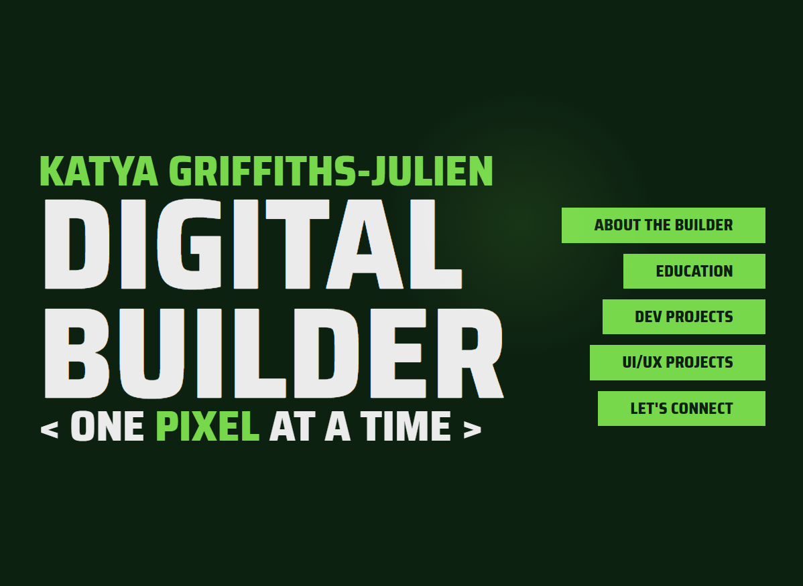
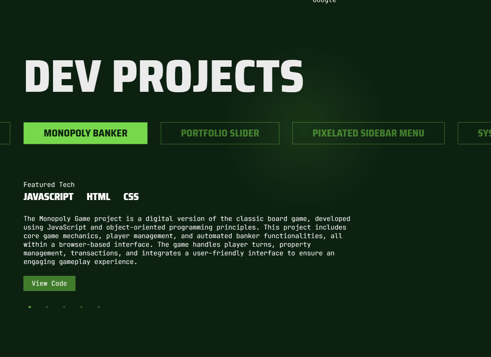

# Portfolio

Welcome to my portfolio website, showcasing my skills in software engineering and UI/UX design. This site is designed to provide an overview of my background, education, projects, and how to connect with me.

## Table of Contents

1. [Project Overview](#project-overview)
2. [Features](#features)
3. [Technologies Used](#technologies-used)
4. [Setup](#setup)
5. [Usage](#usage)
6. [Screenshots](#screenshots)
7. [License](#license)

## Project Overview

This portfolio website is a comprehensive display of my work, skills, and educational background. It includes sections for my biography, education, development projects, UI/UX projects, and contact information.

## Features

- **Hero Section:** An engaging introduction with navigation to different sections of the portfolio.
- **About Section:** Details about my background, development skills, and design skills.
- **Education Section:** Information on my degrees, certifications, and relevant training.
- **Projects Section:** Showcases of my development and UI/UX projects with sliders for easy navigation.
- **Contact Section:** Ways to connect with me via email, LinkedIn, GitHub, and Dribbble.

## Technologies Used

- **HTML5**: For the structure of the web pages.
- **CSS3**: For styling and layout, including Flexbox and Grid.
- **JavaScript**: For interactivity and dynamic content.
- **Slick Carousel**: For the project sliders.
- **GSAP**: For smooth scrolling and animations.
- **Lenis**: For smooth scroll behavior.

## Setup

1. Clone the repository:

    ```bash
    git clone https://github.com/your-username/portfolio.git
    ```

2. Navigate to the project directory:

    ```bash
    cd portfolio
    ```

3. Open `index.html` in your preferred web browser to view the site.

## Usage

- **Navigate** through different sections of the website using the hero section links.
- **Explore** my development and UI/UX projects using the project sliders.
- **Connect** with me through the contact section for collaboration or inquiries.

## Screenshots





## License

This project is licensed under the MIT License - see the [LICENSE](LICENSE) file for details.
